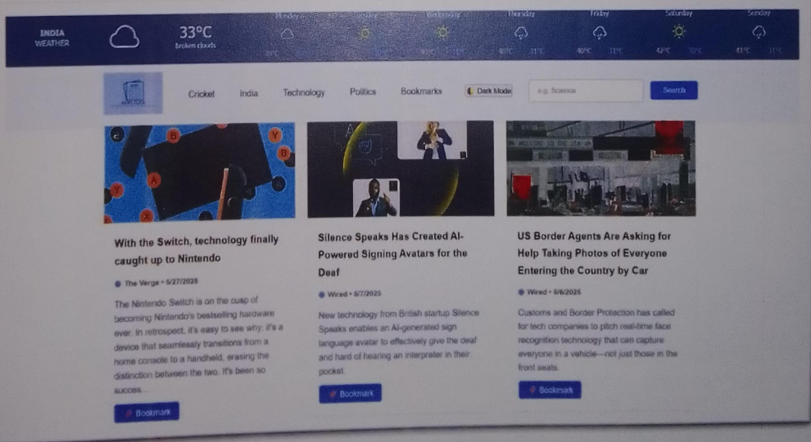
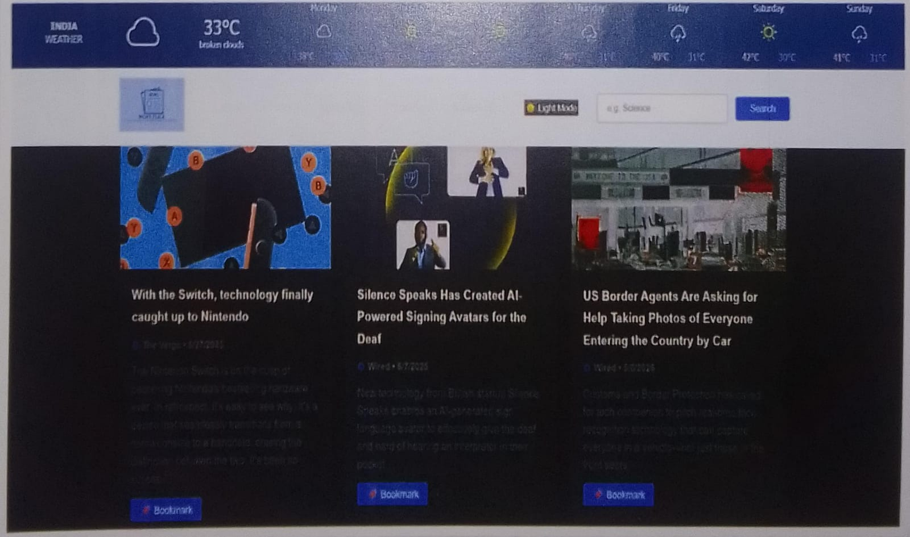
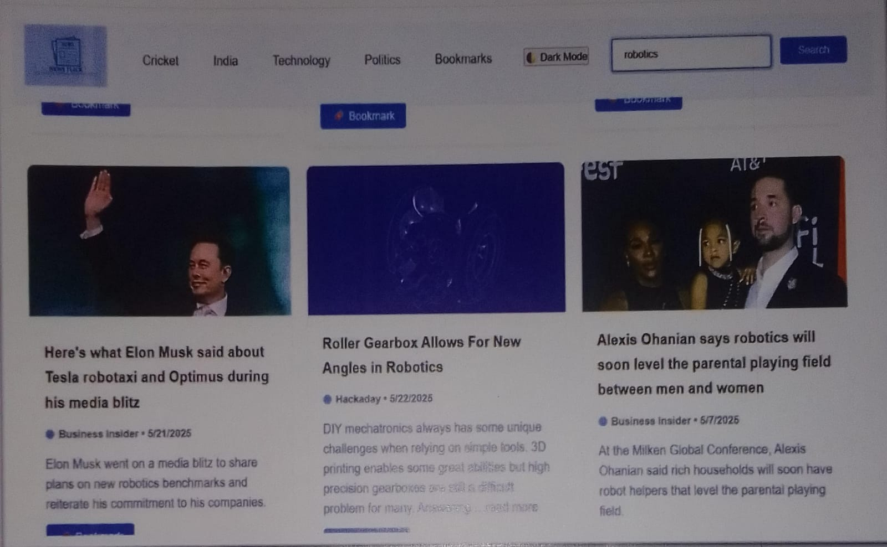

# NewsFlick Webapp 

A responsive web app that aggregates real-time news and integrates weather data using **NewsAPI** and **OpenWeatherMap API**.

##  Live Demo  
[Try it now](https://saba4405.github.io/Newsflick-web-app/)

##  Tech Stack  
- **HTML5**  
- **CSS3** (Flexbox / CSS Grid)  
- **JavaScript**  
- **APIs:** NewsAPI, OpenWeatherMap  

##  Features  
- Search for news by keyword or category  
- Fetches latest headlines from multiple sources  
- Displays current weather for a chosen location  

##  Screenshots  

### Desktop View

### Dark Mode

### Light Mode

### Bookmark Article

### Remove Bookmark

   

## 📂 Project Structure  
newsflick-webapp/
├── index.html # Main entry point
├── styles.css # Styles for layout and design
├── script.js # Core JavaScript logic for fetching and displaying news
├── /images # Contains app icons and graphics
├── /assets # Fonts or other resources
└── README.md # Project documentation
